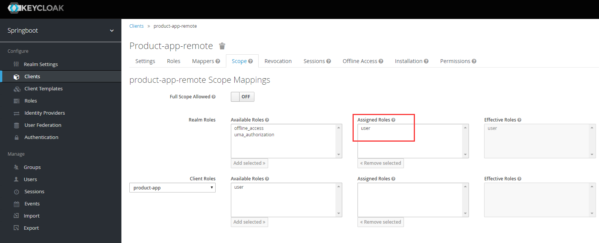

# spring-boot-security-keycloak

本文主要包括两方面的内容：
- Keycloak的spring security adapter的使用方法
- Keycloak的spring security adapter中的client to client的使用方法

## 一、spring security adapter

keycloak adapter通过 KeycloakAuthenticationProcessingFilter 完成认证，过程中调用`org.keycloak.adapters.AdapterUtils`获取用户角色：
```
public static Set<String> getRolesFromSecurityContext(RefreshableKeycloakSecurityContext session) {
        Set<String> roles = null;
        AccessToken accessToken = session.getToken();
        if (session.getDeployment().isUseResourceRoleMappings()) {
            if (log.isTraceEnabled()) {
                log.trace("useResourceRoleMappings");
            }
            AccessToken.Access access = accessToken.getResourceAccess(session.getDeployment().getResourceName());
            if (access != null) roles = access.getRoles();
        } else {
            if (log.isTraceEnabled()) {
                log.trace("use realm role mappings");
            }
            AccessToken.Access access = accessToken.getRealmAccess();
            if (access != null) roles = access.getRoles();
        }
        if (roles == null) roles = Collections.emptySet();
        if (log.isTraceEnabled()) {
            log.trace("Setting roles: ");
            for (String role : roles) {
                log.trace("   role: " + role);
            }
        }
        return roles;
    }
```
获取角色有两种方式：`use-resource-role-mappings` 和 `use realm role mappings`，本示例中使用`use realm role mappings`。

若要使用`use-resource-role-mappings`需要在`application.properties`中配置：
```
keycloak.use-resource-role-mappings = true
```
TODO：关于`use-resource-role-mappings`说明。

### 注意：
客户端要读取用户的角色信息，必须在keycloak的client的scope设置可被访问的角色：



## 二、client to client


参考:
---
[keycloak spring_security_adapter](http://www.keycloak.org/docs/latest/securing_apps/index.html#_spring_security_adapter)
[Secure a Spring Boot Rest app with Spring Security and Keycloak](https://sandor-nemeth.github.io/java/spring/2017/06/15/spring-boot-with-keycloak.html)
[keycloak + spring adapter +spring security reverse proxy redirecting to root
](https://stackoverflow.com/questions/48231269/keycloak-spring-adapter-spring-security-reverse-proxy-redirecting-to-root?rq=1)
[[keycloak-user] Question about Realm and Client (Resource) Roles](http://lists.jboss.org/pipermail/keycloak-user/2016-January/004329.html)
> In the admin console you can manage realm roles from the "Roles" link in
the menu on the left hand side. Further you can manage roles for a client
(service) by finding the client first, it then has a tab for roles. For
clients (front-ends) there's a scope tab that let's you control what roles
the client is allowed to obtain.

>Once you've done that a client that receives a token will contain the roles
the user and client is permitted to have. When this token is sent to the
service the adapter then checks if the token contains the required roles.
The service can either use realm roles (global roles) or roles specific to
itself (client roles, which is enabled by
setting use-resource-role-mappings to true in the keycloak.json file for
the service).

[How to create keycloak client role programmatically and assign to user
](https://stackoverflow.com/questions/43222769/how-to-create-keycloak-client-role-programmatically-and-assign-to-user)
[Authentication with Spring Boot, Angular 2 and Keycloak](http://slackspace.de/articles/authentication-with-spring-boot-angular-2-and-keycloak/)
[CORS与Spring Security(Springboot)](https://www.jianshu.com/p/27060722843b)